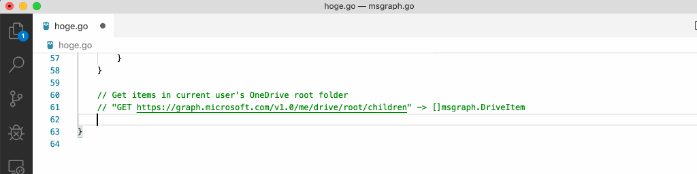

# msgraph.go

[](https://github.com/yaegashi/msgraph.go/actions)

|v1.0|beta|
|---|---|
|[](https://pkg.go.dev/github.com/yaegashi/msgraph.go/v1.0)|[](https://pkg.go.dev/github.com/yaegashi/msgraph.go/beta)|

(The online references at pkg.go.dev above are not shown due to huge size of packages - [#23](https://github.com/yaegashi/msgraph.go/issues/23))

## Introduction

[Microsoft Graph] client library for Go.  Still in PoC or pre-alpha stage.
Don't use in production.

The library code is auto-generated from the REST API specification
available at https://graph.microsoft.com/v1.0/$metadata.

The code generator is written in pure Go,
in contrast to [the official code generator][Microsoft Graph SDK Code Generator]
heavily relying on C# and non-portable .NET Framework.

## v0.x.x releases

See [GitHub releases](https://github.com/yaegashi/msgraph.go/releases)
for all release tags and release notes,
and [pkg.go.dev](https://pkg.go.dev/mod/github.com/yaegashi/msgraph.go)
for all Go module versions available for your applications.

Until v1.0.0, all types of changes might be included in every release:
bug fixes, new features, even incompatible API updates.

## Usage

You can choose API version when importing `msgraph` package:

```go
import msgraph "github.com/yaegashi/msgraph.go/v1.0"
```

```go
import msgraph "github.com/yaegashi/msgraph.go/beta"
```

You could benefit from better IDE assisted coding experience
because Graph API specs are completely translated to Go codes by msgraph.go.



Code examples in the repository:

- [cmd/msgraph-me](cmd/msgraph-me): Show the profile of signed in user (me) and download files in the root folder of their drive
- [cmd/msgraph-usergroup](cmd/msgraph-usergroup): Graph user/group manipulation example
- [cmd/msgraph-sshpubkey](cmd/msgraph-sshpubkey): Manage SSH public keys in the open extension of graph user resources
- [cmd/msgraph-spoget](cmd/msgraph-spoget): Download a file with SharePoint Online URL

## Hacking

Run `go generate ./gen` to download the metadata and generate library code from it.

```console
$ go generate ./gen
2020/08/02 19:46:20 Downloading https://graph.microsoft.com/v1.0/$metadata to metadata/v1.0.xml
2020/08/02 19:46:20 metadata/v1.0.xml already exists, skipping
2020/08/02 19:46:21 Downloading https://graph.microsoft.com/beta/$metadata to metadata/beta.xml
2020/08/02 19:46:21 metadata/beta.xml already exists, skipping
2020/08/02 19:46:21 Creating directory ../v1.0
2020/08/02 19:46:21 Removing ../v1.0/ModelAverage.go
2020/08/02 19:46:21 Removing ../v1.0/RequestSchema.go
2020/08/02 19:46:21 Removing ../v1.0/RequestAndroid.go.go
...
2020/08/02 19:47:06 Creating ../v1.0/extensions.go
2020/08/02 19:47:06 Creating ../v1.0/msgraph.go
2020/08/02 19:47:06 Creating ../v1.0/const.go
2020/08/02 19:47:06 Creating ../v1.0/EnumAction.gonEnum.go
...
2020/08/02 19:47:07 Formatting ../v1.0/ModelMedia.go
2020/08/02 19:47:07 Formatting ../v1.0/RequestWorkbookFunctionsN.go
2020/08/02 19:47:07 Formatting ../v1.0/EnumReject.go
```

(Currently code generation from the latest metadata is broken - [#22](https://github.com/yaegashi/msgraph.go/issues/22))

## Todo

- [x] Save indented metadata.xml
- [x] Support Action elements in metadata
- [ ] Support Function elements in metadata
- [ ] Support batch requests
- [x] Access to additional properties like `@odata.type` `@odata.id`
- [x] Split output into multiple files
- [x] Generate camel cases in golang manner (`IpAddress` -> `IPAddress`)
- [x] Provide easy way to generate pointers to literals
- [x] Provide easy way to generate pointers to constants
- [x] Provide easy way to add queries like `$expand` `$select` `$filter`
- [x] Every request method should take a ctx as the first arg for better control
- [ ] Online API docs (the output is too big for pkg.go.dev to handle - [#23](https://github.com/yaegashi/msgraph.go/issues/23))
- [ ] Unit tests
- [x] CI
- [x] Persist OAuth2 tokens in file
- [x] Persist OAuth2 tokens in object storage like Azure Blob
- [x] OAuth2 device auth grant
- [x] OAuth2 client credentials grant
- [x] Use string for EnumType (pointed out in #6)
- [x] Reduce number of generated files (#11)
- [x] Provide easy way to add HTTP headers like `Prefer: outlook.timezone="Tokyo Standard Time"`
- [ ] Support max number of pages to retrieve from a collection
- [x] Support Windows time zone names in DateTimeTimeZone (utilize [wtz.go](https://github.com/yaegashi/wtz.go))

## References

- [Microsoft Graph]
- [Microsoft Graph REST API reference]
- [Microsoft Graph SDKs - Requirements and Design]
- [Microsoft Graph SDK Code Generator]
- [GitHub repository search for msgraph in Go]
- [Microsoft Graph API Library for Go] (presentation in Japanese)
- [msgraph.go demo - SharePoint Online + Microsoft Flow + GitLab CI] (screencast in YouTube)

[Microsoft Graph]: https://developer.microsoft.com/en-us/graph
[Microsoft Graph REST API reference]: https://docs.microsoft.com/en-us/graph/api/overview
[Microsoft Graph SDKs - Requirements and Design]: https://microsoftgraph.github.io/msgraph-sdk-design/
[Microsoft Graph SDK Code Generator]: https://github.com/microsoftgraph/MSGraph-SDK-Code-Generator
[GitHub repository search for msgraph in Go]: https://github.com/search?l=Go&q=msgraph&type=Repositories
[Microsoft Graph API Library for Go]: https://www.slideshare.net/yaegashi/microsoft-graph-api-library-for-go
[msgraph.go demo - SharePoint Online + Microsoft Flow + GitLab CI]: https://www.youtube.com/watch?v=DwKk405XyF4

## Applications

- [Terraform Provider for Microsoft Graph](https://github.com/yaegashi/terraform-provider-msgraph)
